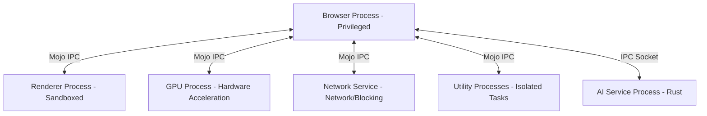

# Aether Architecture Overview

## 1. System Overview

Aether is a production-grade, privacy-focused web browser built on a Brave Browser foundation, which itself is a fork of Chromium. Aether retains Chromium's high-performance rendering engine (Blink) and JavaScript engine (V8) but departs significantly in its user interface and AI integration. 

The architecture consists of three core tiers:
- **Core Browser Engine**: A Brave/Chromium C++ foundation that manages networking, security sandboxing, graphics rasterization, and web standards compliance.
- **Frontend UI Layer**: A modern React 19 + TypeScript interface built via the Vite build pipeline and served using Chromium's secure WebUI system.
- **AI & Sync Services Backend**: Local services written in Rust that execute alongside the browser to handle advanced AI orchestration, credential brokerage, and end-to-end encrypted synchronization.

## 2. Process Architecture

Aether inherits and extends Chromium's multi-process architecture to guarantee stability, security sandboxing, and responsiveness.

### Browser Process
The main browser process runs with the privileges of the active system user. It coordinates window creation, manages the tabs lifetime, handles disk I/O, routes IPC messages between all other processes, and serves as the central control point for the application.

### Renderer Processes
Each tab or origin domain runs in its own sandboxed Renderer Process. It executes the Blink layout engine and the V8 JavaScript virtual machine. Renderers have no direct access to the operating system APIs, filesystem, or hardware; they must request resources from the Browser Process via Mojo IPC.

### GPU Process
A single, dedicated GPU Process handles hardware-accelerated rasterization and UI compositing. By separating graphics operations from the Browser Process, driver crashes or device errors do not crash the browser.

### Network Service Process
A separate process managing network socket connections, HTTP/HTTPS protocol parsing, and caching. In Aether, Brave's Rust-based ad-blocking engine executes directly within or close to this process to filter network requests before they are parsed or rendered.

### Utility Processes
Short-lived, highly restricted processes spawned by the Browser Process to run tasks that require isolation, such as audio decoding, print preparation, and local storage access.

### AI Service Process
A separate native process built in Rust that manages model routing, prompt building, token management, and local context storage. It communicates with the main C++ Browser Process over a local IPC socket.

## 3. UI Architecture

Aether's user interface (tabs, address bar, sidebar, and internal settings pages) is implemented as a React 19 + TypeScript application. This frontend is served via Chromium's **WebUI** system.

- **WebUI Hosting**: The frontend is registered under a secure custom scheme (such as `chrome://` or `aether://`). The browser process hosts the resources, which are executed in a sandboxed Renderer Process reserved for trusted browser chrome.
- **IPC communication**: React components communicate with the C++ browser process using **Mojo IPC TypeScript bindings**. This permits bidirectional event streaming, state synchronization (via Zustand), and call-and-response execution without exposing raw filesystem or OS APIs to the UI.
- **Isolation**: Standard web pages run in unprivileged Renderer Processes and are completely isolated from Aether's WebUI frontend.

## 4. AI Architecture

Aether integrates a local Rust backend service to broker and coordinate artificial intelligence operations:

- **Model Routing**: The AI service acts as an intelligent proxy. It evaluates incoming requests and routes them dynamically.
  - **Primary Model**: Claude Opus 4.6 (accessed via the Anthropic API) for complex reasoning, UI layout generation, and developer tools.
  - **Fallback Model**: Gemini 3.5 Flash (accessed via the Antigravity/Google AI API) for fast summaries, minor text operations, and high-frequency UI interactions.
- **Security & Key Management**: API keys and tokens are never stored in cleartext. They are brokered by the local Rust service, which interfaces with native OS credential stores (Windows Credential Manager / DPAPI).
- **Streaming & Context**: The AI service manages local prompt history, context compression, and routes token streams asynchronously back to the React WebUI.

## 5. Data Architecture

- **Local Databases**: Aether uses SQLite databases to manage user profiles, bookmarks, browsing history, and configuration state.
- **Encryption at Rest**: Sensitive data (such as passwords, cookies, and sync credentials) is encrypted at rest using OS-level cryptographic APIs (DPAPI on Windows).
- **Cloud Synchronization**: Aether's synchronization system is optional and designed around a zero-knowledge, end-to-end encrypted (E2EE) framework. Data is encrypted client-side using user-derived keys before being transmitted to the synchronization server. Conflict Resolution is managed via Conflict-Free Replicated Data Types (CRDTs).

## 6. Repository Layout

- **`.aether`**: Contains AI agent prompts, knowledge system references, and research files.
- **`.github`**: Houses GitHub action workflows, CI/CD pipelines, and pull request templates.
- **`.vscode`**: Shared team configuration files for VS Code editor settings, tasks, and debugger launches.
- **`android`**: Source files, configurations, and build scripts for the Android target platform of Aether.
- **`docs`**: Technical documentation, guides, and architectural designs for Aether.
- **`extensions`**: Development code and resources for custom browser extensions integrated into Aether.
- **`src`**: Main source code directory containing browser C++ files, Rust backend services, and React WebUI source code.
- **`tests`**: Test suites, unit tests, integration tests, and environment validation test scripts.
- **`tools`**: Development utility scripts, build configuration gn/gni assets, and environment verification automation.
