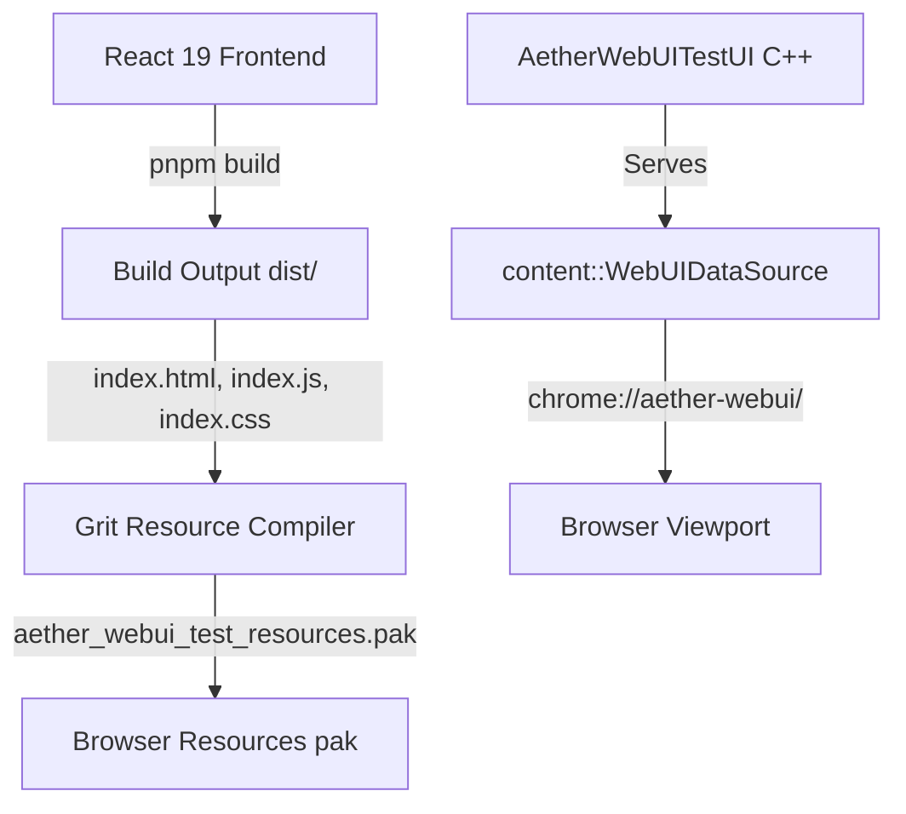

# Aether WebUI Architecture

This document describes the design, build pipeline, and integration patterns for Aether's React-based WebUI frontend.

## System Overview

Aether's user interface (browser chrome, settings, new tab page, etc.) is built using web technologies and integrated directly into Chromium.

## Build Pipeline Flow

1. **Source Code**: Written in TypeScript and React 19 inside [src/webui/](file:///e:/Aether/src/webui/src/).
2. **Build Tool**: Vite 8 compiles and bundles the codebase. When building for production, assets are output without hashed filenames to [src/webui/dist/](file:///e:/Aether/src/webui/dist/) for compatibility with Chromium's static resource pack mappings.
3. **Resource Packaging**: Chromium's GRIT resource compiler reads [aether_webui_test_resources.grd](file:///e:/Aether/src/browser/webui/resources/aether_webui_test_resources.grd) and packages the HTML, JS, and CSS files into a binary `.pak` file (`aether_webui_test_resources.pak`), which is repacked into the main browser resource bundles.
4. **C++ Controller Registration**: Navigation to `chrome://aether-webui/` is intercepted by the browser process and handled by `AetherWebUITestUI`, which instantiates a `WebUIDataSource` serving files directly from the packaged `.pak` archive.

## Code and Layout Conventions

- **Design System Tokens**: All components must use design tokens defined as CSS custom variables in [tokens.css](file:///e:/Aether/src/webui/src/styles/tokens.css). Hardcoding color, spacing, or animation duration values is prohibited.
- **No Inline Styles**: Standard components must not use inline style objects (`style={{ ... }}`). Styling must be declared in modular CSS files or global stylesheets.
- **Process Communication**: WebUI-to-browser process communication must be declared in [BrowserBridge.ts](file:///e:/Aether/src/webui/src/chrome/services/BrowserBridge.ts) as asynchronous method interfaces. The build utilizes `__AETHER_DEV__` compile-time definitions to completely tree-shake `BrowserBridge.mock.ts` out of production releases.
- **Emoji Restriction**: No emojis may be included in source code, comments, documentation, or commit messages.
